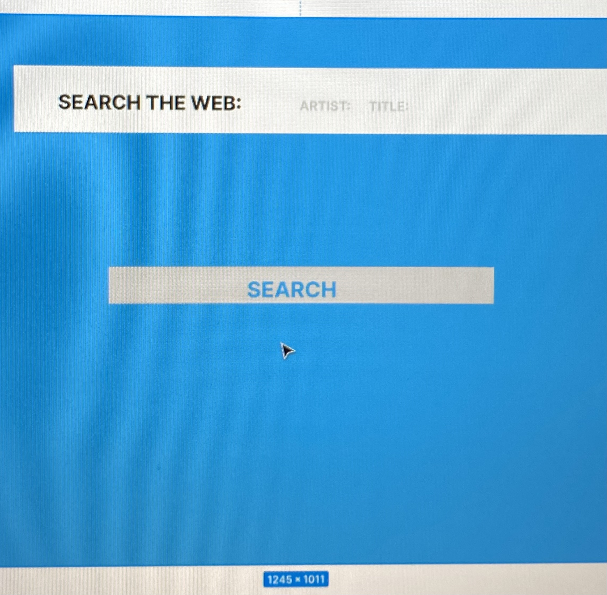
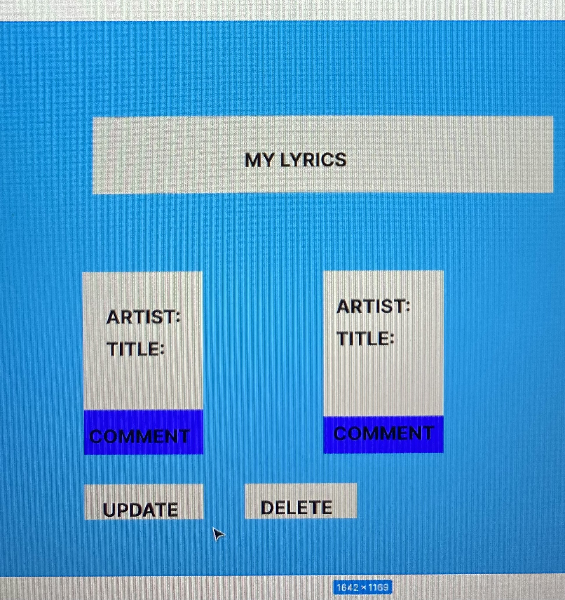

# uni_verse_client
### USER STORY

### PROJECT PROMPT
A full-stack application utilizing React(front-end) and Express(back-end) for users to search and comment about song lyrics. 

1. Unregistered user will be able to navigate to lyric index  as home page
2. Unregistered user will be able to sign up(register) using their email
3. Unregistered user can comment on song lyrics
4. Unregistered user will be able to click on any song lyrics on home page and go to a show page of that song lyrics
5. Unregistered user can view any other credentialed user’s comments from a lyrics show page
6. Registered user will be able to sign in
7. Credentialed user will be able to sign out
8.  Credentialed user will be able to update password
9.  Credentialed user will be able to click on any song lyrics and go to the show page.
10. Credentialed user can create lyrics to the index page with the click of an “create lyrics” button
11. Credentialed user can choose to delete their own lyrics they added from the via the lyrics show page
12. Credentialed user can post comments about lyrics from the lyrics show page
13. Credentialed user can view any other credentialed user’s comments from a lyrics show page
14. Credentialed user can delete their own comments from the lyrics show page
15. Credentialed user can edit their own past comments on the lyrics show page

### WIRE FRAMES

### ERD (entity relationship diagram)

### seeded data
https://www.azlyrics.com/
### API
### https://lyricsovh.docs.apiary.io/

##### STRETCH GOALS
-be able to create and like lyrics

### Lyric Views

| Route | Description |
| ----- | ----------- |
| / lyrics/    | lyrics index  |
| /lyrics/:id | lyric show page |
| /addLyrics	new lyric page
| /lyrics/ | create lyric |
| /lyrics/:id | update lyric |
| /lyrics/:id | DELETE lyric |
Lyric show page will have a modal for updating.
Users will be able to delete via the show page.
Lyric show page will also allow updating and deleting Comment.

### Comment Views

| Route | Description |
| ----- | ----------- |
| /addComment |	new Comment page
| /comments/:lyricId| create comment |
| /comments/:lyricId/:commentId | update comment |
| /comments/:lyricId/:commentId | DELETE comment |
### API repo
https://github.com/SunGod7/my_uni_verse_api
### deployed
https://uni-verse1.herokuapp.com/
### Client repo 
https://uni-verse1.herokuapp.com/