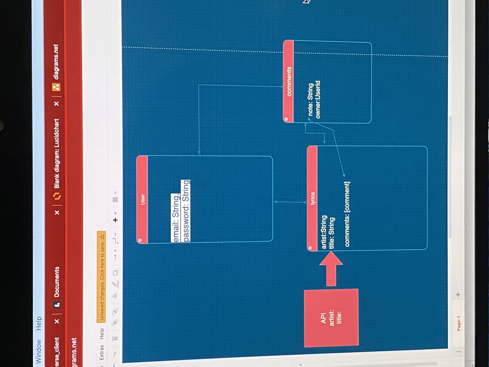

# uni_verse_client
### USER STORY

### PROJECT PROMPT
A full-stack application utilizing React(front-end) and Express(back-end) for users to search and comment about song lyrics. 

1. Unregistered user will be able to navigate to book index  as home page
2. Unregistered user will be able to sign up(register) using their email
3. Unregistered user can search for song lyrics, but not  comment or  until login
4. Unregistered user will be able to click on any song lyrics on home page and go to a show page of that song lyrics
5. Unregistered user will be able to enter a song title and artist name in a search box and view a show page of the searched song lyrics
6. Unregistered user will get feedback saying their search is invalid if they type in an invalid title or artist name to lyrics
7. Unregistered user can view any other credentialed user’s comments from a lyrics show page
8. Registered user will be able to sign in
9. Credentialed user will be able to sign out
10. Credentialed user will be able to update password
11. Credentialed user will be able to click on any song lyrics and go to the show page.
12. Credentialed user can add any searched lyrics to the index page with the click of an “Tag” button
13. Credentialed user can choose to delete their own lyrics they added from the via the book’s show page
14. Credentialed user can post comments about lyrics from the lyrics show page
15. Credentialed user can view any other credentialed user’s comments from a lyrics show page
16. Credentialed user can delete their own comments from the lyrics show page
17. Credentialed user can edit their own past comments on the lyrics show page

### WIRE FRAMES

### ERD (entity relationship diagram)

### API
### https://lyricsovh.docs.apiary.io/

##### STRETCH GOALS
-be able to create and like lyrics